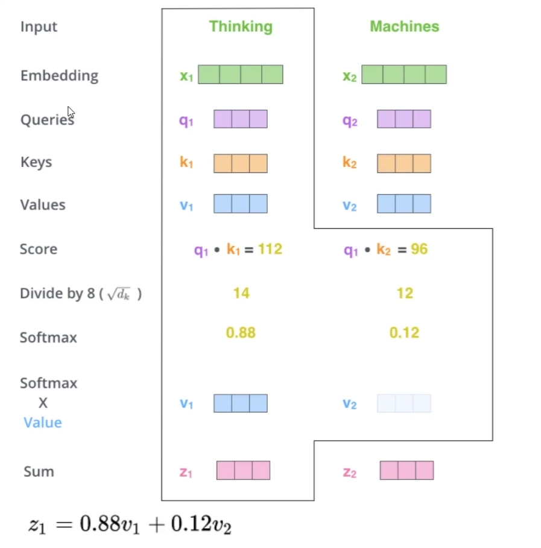
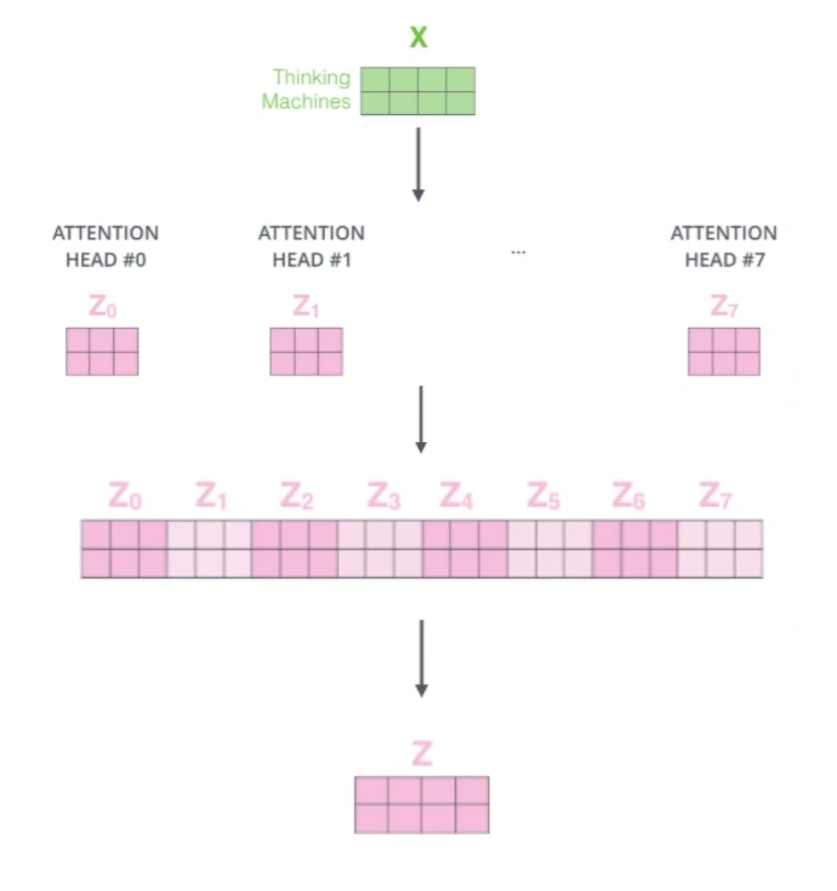
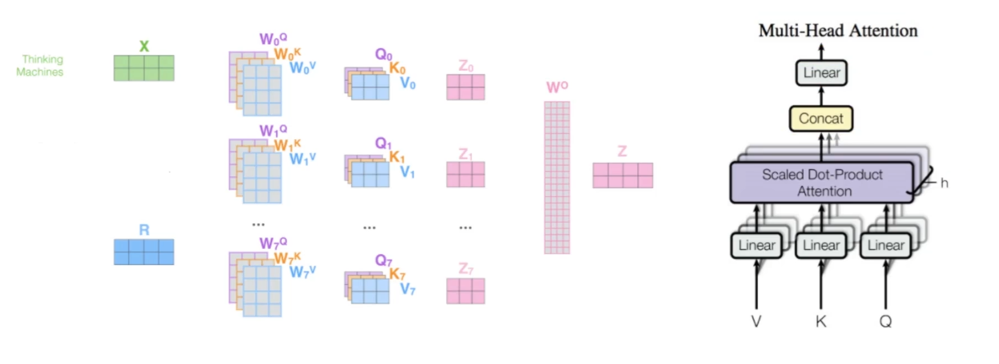
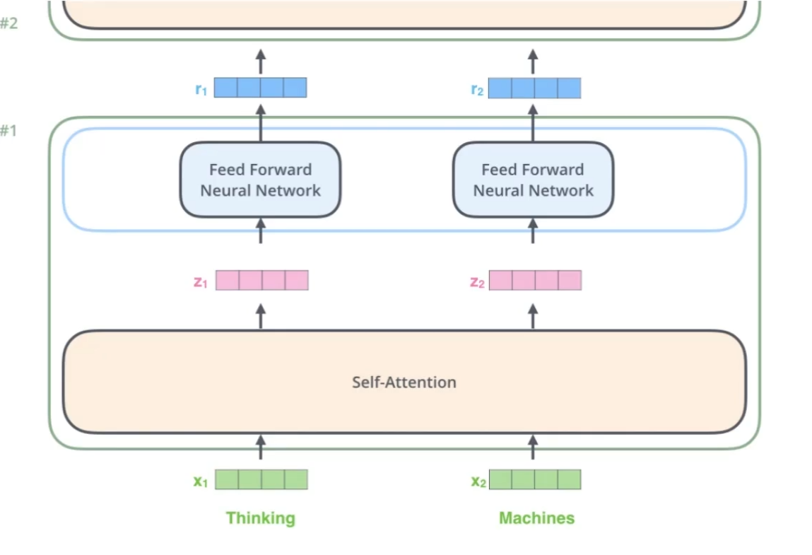
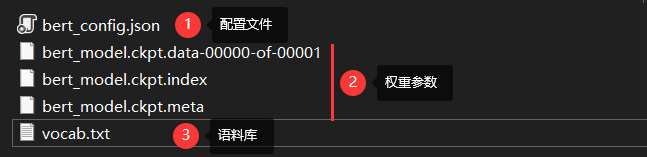
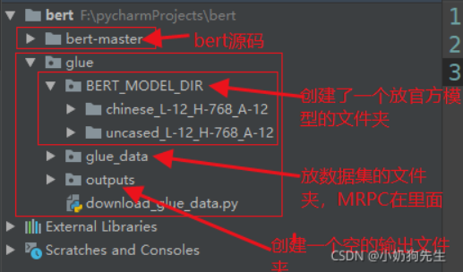
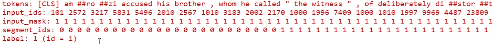
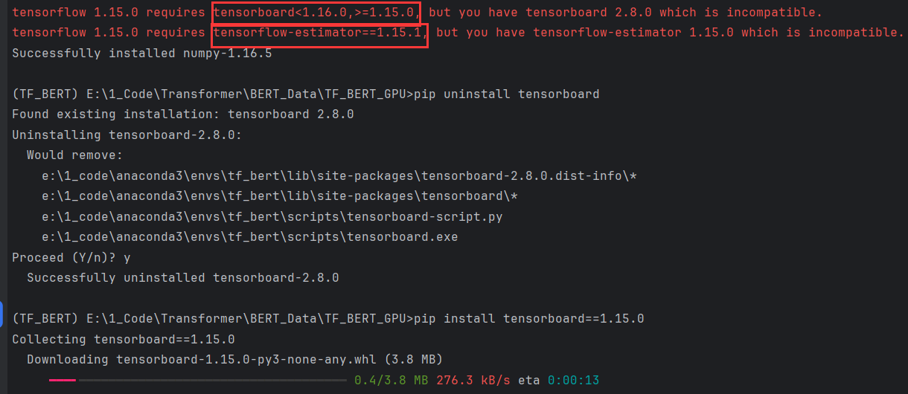
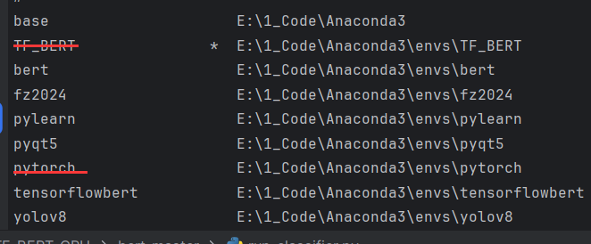
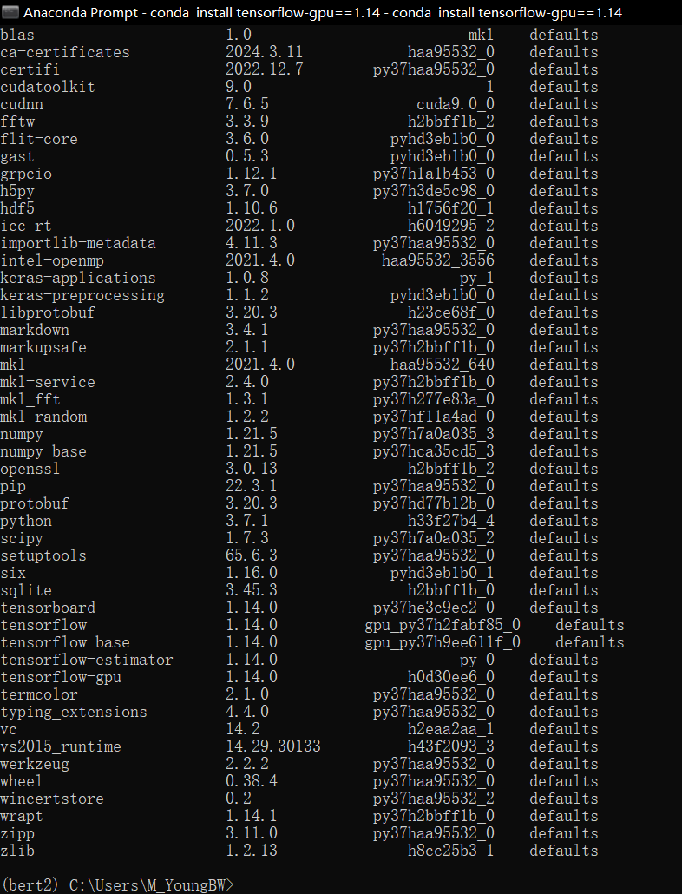

# self-attention

可以结合上下文预测

### self-attention的计算

self-attention其实是在计算每个单词对当前单词的贡献，也就是对每个单词对当前单词的贡献进行打分score。

在词向量矩阵X的基础上乘上WQ、WK、WV权重得到三个矩阵：Q(query去查)、K(key被查)、V(value实际特征信息)

相关性越大，内积越大。假设有两个词的q1、k1、q2、k2，可以通过计算q1 * k1、q2 * k2（称为内积）计算相关性。

softmax(内积)得到一个归一化的初始概率值，归一化的初始概率值除以维度得到归一化的实际概率值。使用这个概率值与v相乘得到一个结果，将所有的结果相加即为该词的self-attention。




# multi-headed

一组qkv得到了一组特征表达，何必只用一组qkv呢，可以用类似卷积神经网络的filter一样(搞一堆特征图)。

一般做8个头(qkv)，将得到的特征通过一层**全连接层**降维






# 堆叠多层

x完成一次self-attention后得到了z，如何进行multi-headed之后得到了r。r同样是一个向量，仍然可以在进行多次self-attention和multi-headed，如此堆叠多层。




# 如何训练BERT

实质上就是训练出transformer的encoder段

### 谷歌预训练模型文件




### 配置参数



```
--task_name=MRPC \   
--do_train=true \  
--do_eval=true \   
--data_dir=../glue/glue_data/MRPC \
--vocab_file=../glue/BERT_MODEL_DIR/uncased_L-12_H-768_A-12/vocab.txt \   
--bert_config_file=../glue/BERT_MODEL_DIR/uncased_L-12_H-768_A-12/bert_config.json \   
--init_checkpoint=../glue/BERT_MODEL_DIR/uncased_L-12_H-768_A-12/bert_model.ckpt \   
--max_seq_length=128 \   
--train_batch_size=5 \  
--learning_rate=2e-5 \  
--num_train_epochs=1.0 \   
--output_dir=../glue/outputs

```

### 源码解析

预处理任务：先将输入的句子分词，然后转成ID映射。



做词嵌入embedding

完成transformer模型：self-attention、multi-headed和多层堆叠。

# 问题





### 成功的gpu版环境：

```
conda install tensorflow-gpu==1.14
```

