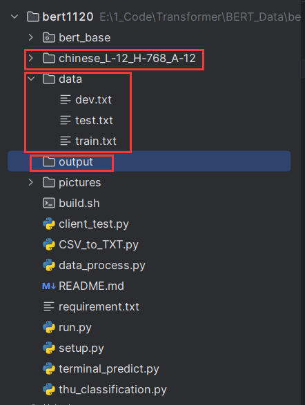

# 克隆必要包

BERT-BiLSTM-CRF-NER

```
git clone https://github.com/macanv/BERT-BiLSTM-CRF-NER
```

chinese_L-12_H-768_A-12

```
https://storage.googleapis.com/bert_models/2018_11_03/chinese_L-12_H-768_A-12.zip
```

微调数据集

```
https://github.com/M-YoungBWeN/NER_Chinese_Database
```


# 环境配置

tensorflow-gpu

```
conda install tensorflow-gpu==1.12.0
```

pyzmq

```
conda install pyzmq==16.0.0
```

软件包详情（参考）

```
# Name                    Version                   Build  Channel   
_tflow_select             2.1.0                       gpu    defaults
absl-py                   0.15.0             pyhd3eb1b0_0    defaults
astor                     0.8.1            py36haa95532_0    defaults
blas                      1.0                         mkl    defaults
ca-certificates           2024.3.11            haa95532_0    defaults
certifi                   2021.5.30        py36haa95532_0    defaults
coverage                  5.5              py36h2bbff1b_2    defaults
cudatoolkit               9.0                           1    defaults
cudnn                     7.6.5                 cuda9.0_0    defaults
cython                    0.29.24          py36hd77b12b_0    defaults
dataclasses               0.8                pyh4f3eec9_6    defaults
gast                      0.5.3              pyhd3eb1b0_0    defaults
grpcio                    1.12.1           py36h1a1b453_0    defaults
h5py                      2.10.0           py36h5e291fa_0    defaults
hdf5                      1.10.4               h7ebc959_0    defaults
icc_rt                    2022.1.0             h6049295_2    defaults
importlib-metadata        4.8.1            py36haa95532_0    defaults
intel-openmp              2023.1.0         h59b6b97_46320    defaults
keras-applications        1.0.8                      py_1    defaults
keras-preprocessing       1.1.2              pyhd3eb1b0_0    defaults
libprotobuf               3.17.2               h23ce68f_1    defaults
markdown                  3.3.4            py36haa95532_0    defaults
mkl                       2020.2                      256    defaults
mkl-service               2.3.0            py36h196d8e1_0    defaults
mkl_fft                   1.3.0            py36h46781fe_0    defaults
mkl_random                1.1.1            py36h47e9c7a_0    defaults
numpy                     1.19.2           py36hadc3359_0    defaults
numpy-base                1.19.2           py36ha3acd2a_0    defaults
openssl                   3.0.13               h2bbff1b_2    defaults
pandas                    1.1.5            py36hd77b12b_0    defaults
pip                       21.2.2           py36haa95532_0    defaults
protobuf                  3.17.2           py36hd77b12b_0    defaults
pyreadline                2.1                      py36_1    defaults
python                    3.6.13               h3758d61_0    defaults
python-dateutil           2.8.2              pyhd3eb1b0_0    defaults
pytz                      2021.3             pyhd3eb1b0_0    defaults
pyzmq                     16.0.0                   pypi_0    pypi
scipy                     1.5.2            py36h9439919_0    defaults
setuptools                58.0.4           py36haa95532_0    defaults
six                       1.16.0             pyhd3eb1b0_1    defaults
sqlite                    3.45.3               h2bbff1b_0    defaults
tensorboard               1.12.2           py36h33f27b4_0    defaults
tensorflow                1.12.0          gpu_py36ha5f9131_0    defaults
tensorflow-base           1.12.0          gpu_py36h6e53903_0    defaults
tensorflow-gpu            1.12.0               h0d30ee6_0    defaults
termcolor                 1.1.0            py36haa95532_1    defaults
typing_extensions         4.1.1              pyh06a4308_0    defaults
vc                        14.2                 h2eaa2aa_1    defaults
vs2015_runtime            14.29.30133          h43f2093_3    defaults
werkzeug                  2.0.3              pyhd3eb1b0_0    defaults
wheel                     0.37.1             pyhd3eb1b0_0    defaults
wincertstore              0.2              py36h7fe50ca_0    defaults
zipp                      3.6.0              pyhd3eb1b0_0    defaults
zlib                      1.2.13               h8cc25b3_1    defaults

```


# 文件结构




# 模型参数配置

```
-data_dir=E:\\1_Code\\Transformer\\BERT_Data\\bert1120\\data
-output_dir=E:\\1_Code\\Transformer\\BERT_Data\\bert1120\\output
-init_checkpoint=chinese_L-12_H-768_A-12/bert_model.ckpt
-bert_config_file=E:\\1_Code\\Transformer\\BERT_Data\\bert1120\\chinese_L-12_H-768_A-12\\bert_config.json
-vocab_file=E:\\1_Code\\Transformer\\BERT_Data\\bert1120\\chinese_L-12_H-768_A-12\\vocab.txt
-batch_size=5
-num_train_epochs=1.0
```

其他参数看[文档](https://github.com/macanv/BERT-BiLSTM-CRF-NER)

