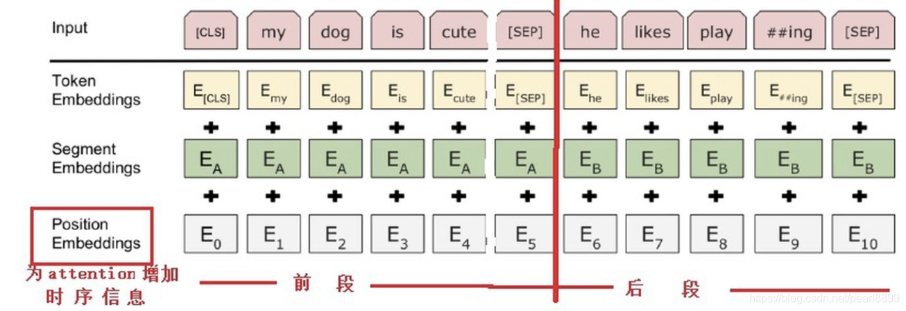

### Transformer模型

一种新颖的序列到序列模型，可以解决各种自然语言处理任务，如机器翻译、文本摘要、情感分析等。

transformer模型有两个大部分：Encoders和Decoders。Google根据Encoders提出了BERT模型，OpenAI根据Decoders提出了GPT-1。


### NLP自然语言处理

### BERT

基于Transformer模型的一种前向和后向预训练语言模型，可以用于多种NLP任务，如文本分类、命名实体识别、问答等。

### PyTorch

Pytorch是torch的python版本，是由Facebook开源的神经网络框架。

[pytorch安装及使用GPU失败的解决办法_pytorch用不了gpu-CSDN博客](https://blog.csdn.net/qq_43344096/article/details/134193998)

### Tokenizer

Tokenizer是一个用于向量化文本，将文本转换为序列的类。

[深度学习文本预处理利器：Tokenizer详解-CSDN博客](https://blog.csdn.net/lsb2002/article/details/133095184)

[Bert的文本编码tokenizer、分隔符(MASK/CLS/SEP)编码_bert编码-CSDN博客](https://blog.csdn.net/pearl8899/article/details/119328276)

BERT模型的输入是文本，需要将其编码为模型计算机语言能识别的编码。



### 预训练和微调

手头任务的训练集数据量较少，先把好用的大模型的大量参数通过大的训练集合预训练。

接下来再通过手头上少的可怜的数据去Fine-tuning(即**微调**参数)，以更适合解决当前的任务。

### 余弦相似度

1. 我们可以将人和事物表示为代数向量
2. 我们可以很容易地计算出相似向量之间的相互关系。

[相似度算法之余弦相似度-CSDN博客](https://blog.csdn.net/zz_dd_yy/article/details/51926305)

### 词嵌入

[什么是词嵌入？| IBM](https://www.ibm.com/cn-zh/topics/word-embeddings)

例如GloVe向量

### N-gram模型和神经网络语言模型（NNLM）

预测/提示下一个单词。

N-gram模型当前词只与距离它比较近的n个词更加相关(一般n不超过5，所以局限性很大)。

NNLM的核心是一个多层感知机（Multi-Layer Perceptron，简称MLP）

### 嵌入矩阵

### Word2Vec

[【图文并茂】通过实例理解word2vec之Skip-gram-腾讯云开发者社区-腾讯云 (tencent.com)](https://cloud.tencent.com/developer/article/1591734)

Word2Vec主要实现方法是Skip-gram和CBO。

CBOW的目标是根据上下文来预测当前词的概率。

Skip-gram刚好相反，其是根据当前词来预测上下文概率的。

#### 连续词袋模型CBOW

[连续词袋模型（CBOW） - emanlee - 博客园 (cnblogs.com)](https://www.cnblogs.com/emanlee/p/17389706.html)

它是一种用于生成词向量的神经网络模型。

CBOW的基本思想是，给定一个单词的上下文（即窗口内的其他单词），预测该单词本身。

#### Skip-gram 模型

### 负采样

基于一定的策略构造与正例相对的负例的过程，称为负采样 (Negative Sampling) 。


## 使用PyTorch部署BERT模型

### 在 PyTorch 中部署 BERT 模型

在 PyTorch 中部署 BERT 模型通常涉及以下几个步骤：

1. **安装必要的库**：
   确保已经安装了 PyTorch 和 Hugging Face 的 Transformers 库。这两个库可以通过 pip 安装：

   ```bash
   pip install torch transformers
   ```

2. **加载预训练的 BERT 模型和分词器**：
   使用 Transformers 库加载预训练的 BERT 模型和分词器。

   ```python
   from transformers import BertTokenizer, BertModel
   
   # 加载预训练的BERT模型和分词器
   tokenizer = BertTokenizer.from_pretrained('bert-base-uncased')
   model = BertModel.from_pretrained('bert-base-uncased')
   ```

3. **对输入进行分词和编码**：
   使用加载的分词器对输入文本进行分词和编码。

   ```python
   input_text = "Hello, how are you?"
   
   # 编码输入文本
   encoded_input = tokenizer(input_text, return_tensors='pt')
   ```

4. **将编码后的输入传递给BERT模型**：
   将编码后的输入传递给BERT模型，并获取输出。

   ```python
   with torch.no_grad():
       outputs = model(**encoded_input)
   
   # 获取BERT模型的最后一个隐藏层的输出
   last_hidden_states = outputs.last_hidden_state
   ```

5. **部署模型**：
   在生产环境中部署模型通常涉及以下几种方法：

   - **使用TorchScript**：将模型转换为TorchScript格式，以便在生产环境中更高效地运行。
   - **使用Flask或FastAPI**：通过API将模型部署为服务。
   - **使用深度学习框架如ONNX**：将模型转换为ONNX格式，以便在不同平台上运行。

### 使用TorchScript部署模型

1. **将模型转换为TorchScript**：

   ```python
   scripted_model = torch.jit.script(model)
   scripted_model.save("bert_model.pt")
   ```

2. **加载TorchScript模型**：

   ```python
   scripted_model = torch.jit.load("bert_model.pt")
   ```

### 使用Flask部署模型

1. **安装Flask**：

   ```bash
   pip install flask
   ```

2. **创建Flask应用**：

   ```python
   from flask import Flask, request, jsonify
   from transformers import BertTokenizer
   import torch

   app = Flask(__name__)

   # 加载分词器和TorchScript模型
   tokenizer = BertTokenizer.from_pretrained('bert-base-uncased')
   model = torch.jit.load("bert_model.pt")

   @app.route('/predict', methods=['POST'])
   def predict():
       data = request.json
       input_text = data['text']

       # 编码输入文本
       encoded_input = tokenizer(input_text, return_tensors='pt')

       # 进行预测
       with torch.no_grad():
           outputs = model(**encoded_input)
       
       # 提取最后一个隐藏层的输出
       last_hidden_states = outputs.last_hidden_state

       # 返回结果
       return jsonify(last_hidden_states.tolist())

   if __name__ == '__main__':
       app.run(host='0.0.0.0', port=5000)
   ```

3. **运行Flask应用**：

   ```bash
   python app.py
   ```

这些步骤将帮助你在PyTorch中部署BERT模型。根据具体需求，可以进一步优化和调整每个步骤。

## 转换PyTorch

下载脚本

[Convert-Bert-TF-checkpoint-to-Pytorch - GitCode](https://gitcode.com/YaoXinZhi/Convert-Bert-TF-checkpoint-to-Pytorch/overview?utm_source=csdn_github_accelerator&isLogin=1)

运行脚本

```python
cd E:\1_Code\Transformer\convert_bert_tf_checkpoint_to_pytorch #进入到convert_tf_checkpoint_to_pytorch.py所在的路径
python convert_tf_checkpoint_to_pytorch.py --tf_checkpoint_path=E:\1_Code\Transformer\chinese_L-12_H-768_A-12\chinese_L-12_H-768_A-12\bert_model.ckpt --bert_config_file=E:\1_Code\Transformer\chinese_L-12_H-768_A-12\chinese_L-12_H-768_A-12\bert_config.json --pytorch_dump_path=E:\1_Code\Transformer\chinese_L-12_H-768_A-12\chinese_L-12_H-768_A-12\pytorch_model.bin
```

